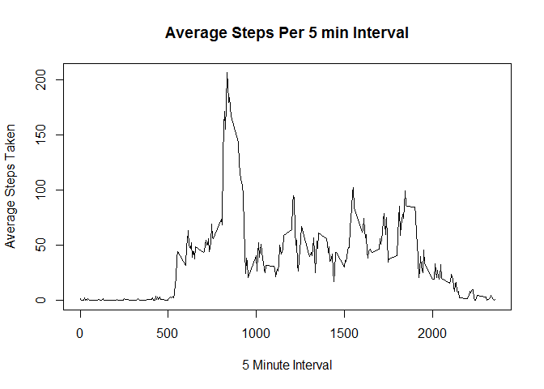

# PA1_template
Nicholas McDannald  
Wednesday, February 04, 2015  
This document is built to satisfy the requirements of the Reproducible Research Course Peer Assessment 1 by Johns Hopkins Bloomberg School of Public Health via CourseRa. Go to [Reproducible Research Page](https://class.coursera.org/repdata-011/human_grading/view/courses/973512/assessments/3/submissions) for more information.

## Download the data
The following code download the zip file from [here](https://d396qusza40orc.cloudfront.net/repdata%2Fdata%2Factivity.zip) and unzips the file to the working directory. First it checks to see if the zip file exists. If so downloading and unzip process is skipped. This process requires the downloader package.


```r
if(!file.exists("pa1.zip")) {
        library(downloader)
        url <- "https://d396qusza40orc.cloudfront.net/repdata%2Fdata%2Factivity.zip"
        download(url,dest="pa1.zip") 
        unzip ("pa1.zip")
}
```

## Loading and Preprocessing the data
Read in the data into R then convert the date field to a data type of date


```r
actdf <- read.csv('activity.csv', header = TRUE)
actdf$date <- as.Date(actdf$date)
```

## What is mean total number of steps taken per day?
1. Calculate the total number of steps taken per day

```r
stepsdf <- aggregate(steps~date, actdf ,sum)
```

2. Make a histogram of the total number of steps taken each day

```r
hist(stepsdf$steps,xlab="Total Number of Steps",
     col="red",main = "Total Steps Each Day")
```

 

3. Calculate and report the mean and median of the total number of steps taken per day

```r
meansteps <- mean(stepsdf$steps)
medsteps <- median(stepsdf$steps)
```

- Mean number of steps: **10766.19** 
- Median number of steps: **10765**


## What is the average daily activity pattern?
1. Make a time series plot (i.e. type = "l") of the 5-minute interval (x-axis) and the average number of steps taken, averaged across all days (y-axis)

1a. Calculate the average number of steps taken per interval

```r
avestepsdf <- aggregate(steps~interval, actdf ,mean)
```

1b. Plot the average number of steps taken per interval

```r
plot(avestepsdf$interval,avestepsdf$steps, type="l", xlab='5 Minute Interval',
     ylab='Average Steps Taken', 
     main="Average Steps Per 5 min Interval")
```

 

2. Which 5-minute interval, on average across all the days in the dataset, contains the maximum number of steps?

```r
maxavesteps <- max(avestepsdf$steps)
subset(avestepsdf,steps == maxavesteps)
```

```
##     interval    steps
## 104      835 206.1698
```

## Imputing missing values
1. Calculate and report the total number of missing values in the dataset (i.e. the total number of rows with NAs)

```r
length(which(is.na(actdf)))
```

```
## [1] 2304
```

2. Devise a strategy for filling in all of the missing values in the dataset. The strategy does not need to be sophisticated. For example, you could use the mean/median for that day, or the mean for that 5-minute interval, etc.

Here I'm going to utilize the optmatch package to help me with filling NAs with 
the default algorithm the package uses.  This default is set by all.covs = TRUE.
Note that I can set this argument to false and set my own calculation. And if time
permits I would like to play around with this package in the future to see if
I can make a better imputation, which the author of the packages encourages.
More information about this package and the Fill.NA function can be found [here](http://www.inside-r.org/packages/cran/optmatch/docs/fill.NAs)

 If the optmatch package can be installed at CRAN.
 
 3. Create a new dataset that is equal to the original dataset but with the missing data filled in.
 
 When creating the new data set.  The date field gets turned into a numeric datatype from the optmatch package.
 To switch the numeric value back to a date value.  I use the zoo package (install from CRAN)
 because the base package function as.Date didn't convert the numeric value
 

```r
library(optmatch)
```

```
## Loading required package: digest
## You're loading optmatch, by B. Hansen and M. Fredrickson.
##  The optmatch package makes essential use of D. P. Bertsekas
##  and P. Tseng's RELAX-IV algorithm and code, as well as
##  Bertsekas' AUCTION algorithm and code.  Using the software
##  to 'satisfy in any part commercial delivery requirements to
##  government or industry' requires a special agreement with
##  Dr. Bertsekas. For more information, enter
##  relaxinfo() at the command line.
```

```r
actdf_fill <- fill.NAs(actdf, data=NULL,all.covs = TRUE, contrasts.arg=NULL)
actdf_fill$steps.NA <- NULL # remove NA TRUE/FALSE Column created by the function.

library(zoo)
```

```
## 
## Attaching package: 'zoo'
## 
## The following objects are masked from 'package:base':
## 
##     as.Date, as.Date.numeric
```

```r
actdf_fill$date <- as.Date(actdf_fill$date)
```

4. Make a histogram of the total number of steps taken each day and Calculate and report the mean and median total number of steps taken per day. Do these values differ from the estimates from the first part of the assignment? What is the impact of imputing missing data on the estimates of the total daily number of steps?

Not too much of a shape difference but the size of a couple of bars increased in size. 

```r
stepsdf_fill <- aggregate(steps~date, actdf_fill ,sum)
hist(stepsdf_fill$steps,xlab="Total Number of Steps",
     col="red",main = "Total Steps Each Day")
```

 


## Are there differences in activity patterns between weekdays and weekends?
For this part the weekdays() function may be of some help here. Use the dataset with the filled-in missing values for this part.

1. Create a new factor variable in the dataset with two levels - "weekday" and "weekend" indicating whether a given date is a weekday or weekend day.


```r
# Get day of week in a new column to make daytype column creation easier
actdf_fill$dayofweek <- as.factor(weekdays(actdf_fill$date))
actdf_fill$daytype <- ifelse(actdf_fill$dayofweek %in% c("Saturday","Sunday"), "Weekend", "Weekday")
```

2. Make a panel plot containing a time series plot (i.e. type = "l") of the 5-minute interval (x-axis) and the average number of steps taken, averaged across all weekday days or weekend days (y-axis). 

In this plot I'm using the ggplot2 package to create the panel plot effect more easily. 


```r
library(ggplot2)

ggplot(actdf_fill, aes(x=interval, y=steps)) + 
        geom_line() + 
        facet_wrap(~ daytype, nrow=2, ncol=1) +
        labs(x="Interval", y="Number of steps") +
        theme_bw()
```

 
